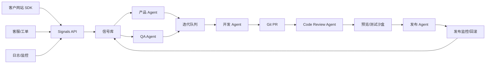

# Itera AI 自迭代平台 MVP

这是“帮助别人网站自进化”的第一版全栈 MVP。它已经不只是静态原型：现在包含本地 API、JSON 数据库、控制台、Web SDK 和一个目标网站 Demo。

## 运行

```bash
npm start
```

启动后访问：

- 控制台：`http://127.0.0.1:8787/index.html`
- 公开接入文档：`http://127.0.0.1:8787/docs`
- 目标网站 Demo：`http://127.0.0.1:8787/demo-target.html`
- 健康检查：`http://127.0.0.1:8787/api/health`

如果想让右侧浏览器实时显示数据，不要使用 `file://.../index.html`，请打开上面的控制台地址。控制台会每 3 秒自动同步一次 API 状态。

Windows 也可以直接运行：

```bash
start-live.bat
```

如果要在本地模拟“生产级自进化链路”，使用这个一键脚本。它会同时启动主平台和独立沙箱 provider，让自动 PR 前先跑外部沙箱验证：

```bash
start-full-local.bat
```

如果 8787 已经被旧服务占用，可以运行备用端口：

```bash
start-8788.bat
```

然后访问 `http://127.0.0.1:8788/index.html`。

## 当前闭环

1. 客户在控制台只填写产品名称和网站网址
2. 平台自动生成 API Key，并立刻展示一行完整嵌入代码
3. 客户复制代码粘贴到自己网站，即可接入 `widget.js`
4. SDK 首次加载会自动发送心跳，确认接入成功
5. 用户提交反馈，或 SDK 捕获错误、性能、API 失败、行为异常信号
6. `POST /api/signals` 接收信号
7. 后端自动分类：Bug、需求、性能、客服
8. 后端生成迭代任务，写入 `data/db.json`
9. 控制台读取 `/api/state` 展示项目健康、反馈、任务和 Agent 日志
10. AI 分析 Agent 聚类反馈、生成优先级和建议任务
11. 代码 Agent 将迭代任务转换为 PR 草稿
12. Patch Agent 根据 PR 草稿生成可审阅的补丁提案
13. QA Agent 对补丁提案生成验证报告和风险决策
14. Sandbox Runner 生成 install、lint、test、build 的沙箱验证结果
15. Readiness Checker 持续计算项目离“自我进化”还差哪些环节
16. Autopilot 可以把已有用户信号自动推进到 PR 草稿、补丁、QA、沙箱和 GitHub/mock PR
17. 输出 Webhook 会把 PR、发布计划、灰度推进、回滚结果推送回客户系统
18. 用户可以审批任务、推进 PR、运行 Agent 巡检、更新策略、导出快照

## 极简接入体验

客户接入流程控制在一个页面、3 步内：

1. 填信息：只填 `产品名称` 和 `网站网址`。
2. 生成 Key：提交后平台自动创建项目、规范化网址、生成 API Key。
3. 复制代码：页面立即展示一行完整嵌入代码，API Key 已填好，点击“一键复制嵌入代码”即可。

生成后的嵌入代码形态：

```html
<script src="https://your-platform.com/widget.js" data-key="sdk-customer-site-xxxx" defer></script>
```

控制台还提供“发送测试信号”按钮，用生成的 API Key 调用 `/api/signals`，确认 API Key、Widget 心跳和 Signals API 已连通。

接入安全规则：

- `/api/signals` 不再自动创建未知项目，必须先生成 API Key。
- SDK Key 必填，可放在请求体 `sdkKey` 或请求头 `X-Itera-SDK-Key`。
- Widget 可以只传 `data-key`；服务端会根据 SDK Key 反查项目。
- 浏览器来源域名必须匹配项目的 `allowedOrigins` 或项目网址 origin。
- 每个项目默认每分钟最多接收 120 条信号，可用 `SIGNAL_RATE_LIMIT_PER_MINUTE` 调整。
- 项目会记录接入健康：通过信号数、拦截信号数、最后成功来源、最后失败原因。

## 多租户隔离

本地 MVP 已加入请求级租户隔离：

- 后台 API 通过 `X-Itera-Tenant` + `X-Itera-Tenant-Key` 识别并校验当前组织。
- 本地默认租户是 `tenant-local`，默认开发 Key 是 `tnk_tenant-local_dev`。
- 新创建的项目会写入当前租户的 `tenantId`。
- `/api/state`、`/api/snapshot`、审计日志、仓库、PR、补丁、发布记录都会按租户过滤。
- 缺少租户 Key、Key 错误、跨租户访问项目、轮换 API Key、创建仓库、生成 PR、发布或回滚都会被拒绝。
- 客户网站 SDK 不需要传租户 header；`/api/signals` 通过 `projectId + sdkKey + allowedOrigins` 授权，并把信号归入项目所属租户。
- 自动化策略也按租户隔离：租户 A 关闭 `autoPr` 不会影响租户 B。
- `POST /api/tenants` 可创建新租户并返回一次性展示的后台 Key；`POST /api/tenant/rotate-key` 可轮换当前租户后台 Key。

本地测试示例：

```bash
curl -H "X-Itera-Tenant: tenant-local" -H "X-Itera-Tenant-Key: tnk_tenant-local_dev" http://127.0.0.1:8787/api/state
curl -X POST -H "Content-Type: application/json" -d "{\"id\":\"tenant-a\",\"name\":\"Tenant A\"}" http://127.0.0.1:8787/api/tenants
```

## 反馈来源

第一版建议优先接 4 个入口：

1. 网站反馈浮窗：用户主动提交问题、建议、评分和联系方式。
2. 前端自动捕获：JS 报错、Promise 异常、页面性能、Web Vitals、接口失败。
3. 行为异常信号：连续点击同一区域，判断按钮无响应或流程卡住。
4. 客服工单导入：把 Intercom、Zendesk、Crisp、企业微信或邮件里的工单批量导入。

## 输出 Webhook

输出 Webhook 是 MVP 的通用“推回客户系统”能力：

- 在项目接入页填写客户系统的回调 URL。
- 点击“发送测试”验证客户系统能收到平台事件。
- 平台会在 `pr.opened`、`release.planned`、`release.promoted`、`release.rolled_back` 等事件发生时发送 POST。
- 每次投递都会写入 `webhookDeliveries`，控制台会展示最近投递状态。
- 请求会携带 `X-Itera-Event`、`X-Itera-Delivery`、`X-Itera-Signature-256`，签名使用项目 SDK Key 计算 HMAC-SHA256。

## 关键文件

- `server.js`：本地 API 服务和静态文件服务
- `data/db.json`：首次运行时自动生成的本地数据库
- `index.html`：控制台入口
- `app.js`：API 驱动的控制台逻辑，API 不可用时退回离线演示
- `widget.js`：给客户网站的一行接入入口，映射到 `sdk/iteration-client.js`
- `sdk/iteration-client.js`：Widget/SDK 实现，支持 Shadow DOM 反馈窗、自动心跳、错误/性能/API/行为采集
- `demo-target.html`：模拟客户网站，用来验证 SDK 上报闭环

## API

- `GET /api/health`
- `POST /api/auth/register`
- `POST /api/auth/login`
- `GET /api/auth/me`
- `POST /api/auth/logout`
- `GET /api/production/status`
- `GET /api/billing/plans`
- `GET /api/billing/current`
- `POST /api/billing/checkout`
- `POST /api/billing/portal`
- `POST /api/billing/webhook`
- `GET /api/state?projectId=a-site`
- `GET /api/readiness?projectId=a-site`
- `GET /api/snapshot?projectId=a-site`
- `POST /api/tenants`
- `GET /api/tenant/current`
- `POST /api/tenant/rotate-key`
- `POST /api/projects`
- `POST /api/projects/:id/rotate-sdk-key`
- `PATCH /api/projects/:id/output-webhook`
- `POST /api/projects/:id/output-webhook/test`
- `POST /api/projects/:id/autopilot`
- `POST /api/signals`
- `POST /api/import/support-tickets`
- `POST /api/ai/analyze`
- `POST /api/repositories/connect`
- `GET /api/github/status`
- `GET /api/github/repositories`
- `GET /api/github/installations?projectId=a-site`
- `POST /api/github/installations`
- `POST /api/github/webhook`
- `POST /api/github/repositories/validate`
- `GET /github/install?projectId=a-site`
- `GET /github/callback`
- `POST /api/pr-drafts`
- `POST /api/pr-drafts/:id/advance`
- `POST /api/pr-drafts/:id/generate-patch`
- `POST /api/patch-proposals/:id/verify`
- `POST /api/patch-proposals/:id/run-sandbox`
- `POST /api/patch-proposals/:id/apply-workspace`
- `POST /api/patch-proposals/:id/run-production-sandbox`
- `POST /api/pr-drafts/:id/open-github`
- `POST /api/pr-drafts/:id/ci`
- `POST /api/pr-drafts/:id/preview`
- `POST /api/pr-drafts/:id/release-plan`
- `POST /api/release-plans/:id/promote`
- `POST /api/release-plans/:id/rollback`
- `GET /api/audit-logs?projectId=a-site`
- `POST /api/plans`
- `POST /api/tasks/approve-safe`
- `POST /api/tasks/:id/advance`
- `POST /api/agent-runs`
- `POST /api/canary`
- `PATCH /api/policy`

## 自进化就绪度与 Autopilot

现在平台会主动判断客户网站离“自我进化”还差什么：

- `GET /api/readiness?projectId=customer-site`：返回项目接入、SDK、信号、任务、仓库、PR 草稿、补丁、QA、沙箱、GitHub PR、自动化策略等检查项。
- `POST /api/signals`：SDK、反馈窗或错误捕获上报信号；低风险且已批准的任务会自动触发 Autopilot，高风险任务会停在人工审批。
- `POST /api/projects/:id/autopilot`：手动或定时触发 Autopilot，自动推进分析、任务选择、仓库准备、PR 草稿、补丁提案、QA 检查、沙箱验证，并在策略与风险允许时打开 GitHub PR。没有配置 `GITHUB_TOKEN` 时会生成 mock PR URL，避免误改真实仓库。

控制台“项目接入”页会显示“自进化就绪度”，点击“运行自进化”即可触发 Autopilot。

```bash
curl http://127.0.0.1:8787/api/readiness?projectId=a-site
curl -X POST http://127.0.0.1:8787/api/projects/a-site/autopilot
```

## 生产级闭环

新增“生产闭环”页内面板，覆盖从补丁到上线后的关键缺口：

1. 工作区应用：`POST /api/patch-proposals/:id/apply-workspace`
   - 将补丁提案写入隔离工作区。
   - `localPath` 只允许在项目目录或 `ITERA_ALLOWED_REPO_ROOT` 下，避免读取任意磁盘路径。
2. 真实沙箱：`POST /api/patch-proposals/:id/run-production-sandbox`
   - 在隔离工作区运行白名单命令。
   - 允许 `node ...`、`npm test`、`npm run lint/build/test:e2e/test:performance`、安全的 `npm install --ignore-scripts`。
   - 拒绝管道、重定向、串联命令和任意 shell 片段。
3. CI 记录：`POST /api/pr-drafts/:id/ci`
   - 把真实沙箱结果沉淀为 CI 状态。
4. 预览部署：`POST /api/pr-drafts/:id/preview`
   - CI 通过后生成 managed preview URL。
5. 灰度发布：`POST /api/pr-drafts/:id/release-plan` 与 `POST /api/release-plans/:id/promote`
   - 默认阶段为 1%、5%、25%、50%、100%。
6. 回滚：`POST /api/release-plans/:id/rollback`
   - 将灰度流量归零，并记录 rollback event。
7. 审计：`GET /api/audit-logs?projectId=...`
   - 仓库连接、工作区应用、真实沙箱、GitHub PR、CI、预览、发布、回滚、策略更新都会留痕。

没有真实 `GITHUB_TOKEN` 或部署平台 token 时，GitHub PR 和预览仍会使用 managed/mock 记录；真实命令沙箱已经会在本地隔离工作区执行。

## SDK 接入示例

```html
<script src="https://your-platform.com/widget.js" data-key="sdk-customer-site-xxxx" defer></script>
```

需要高级配置时仍可使用 `SelfIteratingAI.init(...)`，例如传入 `release`、关闭某类自动采集、或指定自定义 endpoint。

## 客户项目创建示例

```bash
curl -X POST http://127.0.0.1:8787/api/projects \
  -H "Content-Type: application/json" \
  -d '{
    "name": "客户网站",
    "url": "https://customer.example.com",
    "env": "production",
    "allowedOrigins": ["https://customer.example.com"]
  }'
```

控制台的“项目接入”页也可以直接创建项目、复制 `projectId`、查看 `sdkKey`、轮换 `sdkKey`，并自动生成专属 SDK 片段。

## 客服工单导入示例

```bash
curl -X POST http://127.0.0.1:8787/api/import/support-tickets \
  -H "Content-Type: application/json" \
  -d '{
    "projectId": "customer-site",
    "projectName": "客户网站",
    "source": "Zendesk",
    "tickets": [
      {
        "id": "zd-1001",
        "title": "支付失败",
        "text": "用户点击支付按钮后没有任何提示，无法完成订单。",
        "channel": "support",
        "page": "https://customer.example.com/checkout"
      }
    ]
  }'
```

## AI 分析 Agent

点击控制台里的“AI 分析”，或直接调用：

```bash
curl -X POST http://127.0.0.1:8787/api/ai/analyze \
  -H "Content-Type: application/json" \
  -d '{"projectId":"a-site"}'
```

它会输出：

- `summary`：当前项目主要问题总结
- `clusters`：反馈聚类、优先级、影响面、建议
- `suggestedTasks`：可进入迭代队列的任务

默认会使用本地启发式分析，不需要外部服务。配置下面的环境变量后，会优先调用 OpenAI：

```bash
set OPENAI_API_KEY=你的_key
set OPENAI_MODEL=gpt-4.1-mini
npm.cmd start
```

## 代码仓库 Agent / PR 草稿

第一版不会直接改客户线上代码，而是生成安全的 PR 草稿：

1. 连接客户仓库元信息。
2. 从迭代任务生成分支名、PR 标题、改动文件、实现计划、测试计划和 Review 清单。
3. Patch Agent 根据草稿生成补丁提案、验证命令和风险闸门。
4. QA Agent 对补丁进行静态沙箱验证，给出 `auto_pr_allowed`、`manual_review` 或 `blocked` 决策。
5. Sandbox Runner 生成验证命令执行结果和日志摘要。
6. 人工确认后，使用 `GITHUB_TOKEN` 创建真实 GitHub 分支、提交代码文件和证据文件，再打开 PR。

示例：

```bash
curl -X POST http://127.0.0.1:8787/api/repositories/connect \
  -H "Content-Type: application/json" \
  -d '{"projectId":"a-site","provider":"GitHub","owner":"customer","name":"a-site","defaultBranch":"main"}'
```

```bash
curl -X POST http://127.0.0.1:8787/api/pr-drafts \
  -H "Content-Type: application/json" \
  -d '{"projectId":"a-site","taskId":"task-2001"}'
```

生成补丁提案：

```bash
curl -X POST http://127.0.0.1:8787/api/pr-drafts/prd-xxxx/generate-patch
```

补丁提案会包含：

- `patchFiles`：按文件输出的 unified diff 草案
- `verificationCommands`：建议运行的检查命令
- `riskGates`：上线前必须确认的风险条件
- `summary`：面向 Review 的改动说明

生成 QA 验证报告：

```bash
curl -X POST http://127.0.0.1:8787/api/patch-proposals/patch-xxxx/verify
```

QA 报告会包含：

- `checks`：补丁结构、测试覆盖、敏感业务面、发布闸门检查
- `riskScore`：0-100 的风险评分
- `decision`：是否允许自动进 PR、需要人工确认、或阻断
- `nextActions`：下一步处理建议

运行沙箱验证：

```bash
curl -X POST http://127.0.0.1:8787/api/patch-proposals/patch-xxxx/run-sandbox
```

Sandbox Runner 会根据仓库的 `validationConfig` 生成命令结果：

- `npm install`
- `npm run lint`
- `npm test`
- `npm run build`
- 补丁提案里的额外验证命令

当前 MVP 使用托管沙箱运行记录，不会直接在主机上执行客户仓库的任意命令。真实生产版应接入隔离容器、微虚拟机或 CI 服务。

GitHub 集成当前有三种模式：

- `GITHUB_TOKEN` 模式：可验证仓库、创建分支、提交补丁代码文件、提交 `.itera` 证据文件、打开 Pull Request。
- GitHub App 模式：配置 App ID 和私钥后，平台会生成 GitHub App JWT，发现/使用 installation，交换短期 installation token，然后验证仓库、提交代码文件并打开 Pull Request。
- Mock 模式：没有 token 时生成模拟 PR URL，适合本地演示。

当前 MVP 已提供 `open-github` 适配器。有补丁提案时，必须先运行 QA 验证和沙箱验证；验证被阻断或沙箱失败的补丁不会进入 PR。

- 没有 `GITHUB_TOKEN` 或 GitHub App 凭证：生成模拟 PR URL，用于演示流程。
- 配置 `GITHUB_TOKEN`：调用 GitHub API，创建分支，把补丁提案写入目标代码文件，同时提交 `.itera/pr-drafts/<id>.md`、`.itera/patches/<id>.patch.md`、`.itera/qa-reports/<id>.md`，再打开 Pull Request。
- 配置 GitHub App：使用短期 installation token 替代长期 token。支持 `GITHUB_APP_PRIVATE_KEY`、`GITHUB_APP_PRIVATE_KEY_BASE64` 或 `GITHUB_APP_PRIVATE_KEY_PATH`。

Windows PowerShell 示例：

```powershell
$env:GITHUB_TOKEN="你的 GitHub token"
npm.cmd start
```

GitHub App PowerShell 示例：

```powershell
$env:GITHUB_APP_ID="123456"
$env:GITHUB_APP_SLUG="itera-ai"
$env:GITHUB_APP_INSTALLATION_ID="987654" # 可选；不填时会按仓库自动发现 installation
$env:GITHUB_APP_PRIVATE_KEY_PATH="C:\secure\itera-ai.private-key.pem"
npm.cmd start
```

GitHub App 客户安装流程：

1. 平台管理员先在 GitHub 创建 App，并配置 `GITHUB_APP_ID`、`GITHUB_APP_SLUG`、`GITHUB_APP_PRIVATE_KEY_PATH`。
2. 客户在控制台的“代码仓库 / GitHub 授权”卡片点击“安装或重新授权 GitHub App”。
3. 平台会跳转到 `/github/install?projectId=<客户项目>`，生成一次性 `state`，再跳到 GitHub App 安装页。
4. GitHub 回调 `/github/callback?installation_id=...&state=...` 后，平台会把 `installation_id` 绑定到客户项目。
5. 控制台点击“同步授权仓库”，平台通过 installation token 拉取客户授权仓库；没有真实凭证时，也可以用 `POST /api/github/installations` 写入安装记录做本地演示。
6. 客户从授权仓库列表点击“连接”，仓库会保存 `githubInstallationId`，后续 PR、提交和证据文件都走这个项目级 installation。
7. GitHub App 的 Webhook URL 配置为 `https://your-platform.com/api/github/webhook`。如果设置 `GITHUB_WEBHOOK_SECRET`，平台会校验 `X-Hub-Signature-256`。

本地演示安装记录：

```bash
curl -X POST http://127.0.0.1:8787/api/github/installations \
  -H "Content-Type: application/json" \
  -d '{
    "projectId": "a-site",
    "installationId": "demo-installation-1",
    "account": { "login": "customer-org", "type": "Organization" },
    "repositories": [
      {
        "owner": "customer",
        "name": "a-site",
        "fullName": "customer/a-site",
        "defaultBranch": "main",
        "url": "https://github.com/customer/a-site"
      }
    ]
  }'

curl "http://127.0.0.1:8787/api/github/repositories?projectId=a-site"
```

真实 token 需要对目标仓库有这些权限：

- Contents: Read and write
- Pull requests: Read and write

当前真实 GitHub 模式会提交补丁对应的业务代码文件，同时保留 `.itera` 证据文件，方便 Review 和审计。

Webhook 已支持：

- `installation`：安装状态更新、卸载标记。
- `installation_repositories`：客户新增或移除授权仓库时自动同步项目 installation 记录。

## 推荐的真实产品架构



## 下一阶段

1. 把 `data/db.json` 换成 PostgreSQL。
2. 增加 OpenAI 分析 Agent，把当前规则分类升级成 LLM 聚类、摘要和优先级评估。
3. 增加 GitHub App 卸载 webhook、仓库权限变更 webhook 和 Marketplace 计费。
4. 把 managed preview 接入真实部署平台和浏览器巡检。
5. 增加发布守卫：错误率、转化率、客服投诉量触发自动回滚。

最重要的产品原则：先做“AI 发现问题 -> AI 生成任务 -> 人审批 -> 自动验证”，再逐步开放低风险自动上线。
